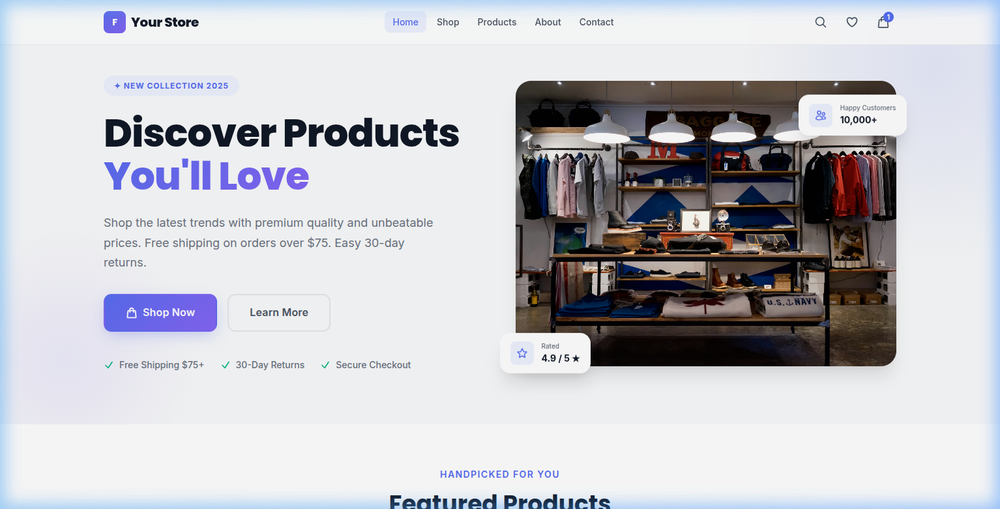
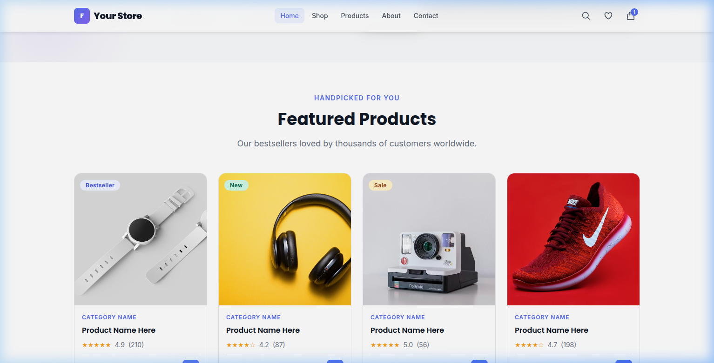
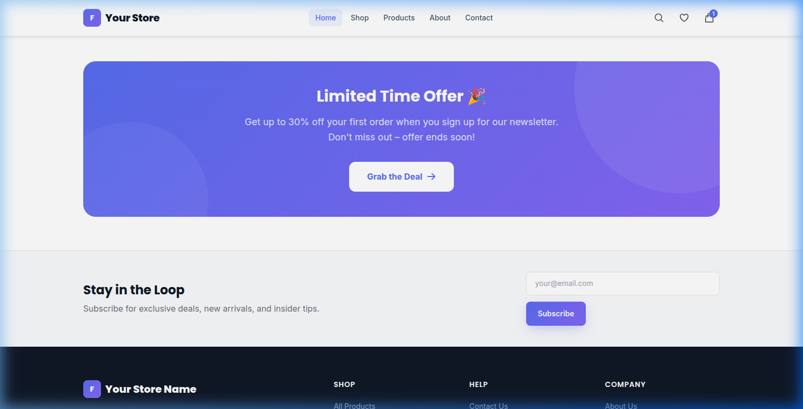

# VIA — Navigate Your Odyssey

> A premium, Afro-Minimalist platform built with Laravel Blade. VIA guides members through a refined brand experience into a structured membership funnel — light, intentional, and built around movement.

---

## ✦ Project Overview

VIA is a personal growth and wealth-ecosystem platform. The design language is calm and high-end: cream backgrounds, terracotta (`#B2734D`) accents, serif typography (**Cormorant Garamond**), and a clean top navigation. The experience communicates clarity and purpose, not urgency.

## ✦ Interface Preview

<div align="center">
  
  <p><i>The Landing Experience: Intentional, Bold, and Minimalist.</i></p>
</div>

<div align="center">
  
  
  <p><i>Curated Storefront: Premium product discovery and category-driven navigation.</i></p>
</div>

---

## ✦ Key Features

### 1. Premium Authentication Experience
We've overhauled the entry point for all members.
- **Split-Panel Design**: A cinematic visual panel on the left with brand taglines, and a clean, focused form on the right.
- **Social Integration**: Seamless sign-in and registration via **Google** and **Facebook**.
- **Interactive Security**: Real-time password strength validation with visual feedback.

### 2. Mobile-First Infrastructure
Designed for the modern professional on the go.
- **Side-Drawer Navigation**: A polished slide-in menu with backdrop blur for an app-like experience on mobile.
- **Horizontal Product Scrollers**: Touch-optimized, side-scrolling product grids that keep the interface neat and interactive.
- **Optimized Footer**: Reorganized 2-column mobile footer for easier access to essential links.

### 3. Modern Storefront
- **Dynamic Product View**: Interactive product details with variant selectors, star ratings, and related product recommendations.
- **Clean Grids**: High-impact imagery and minimalist cards that stack or scroll based on device size.

---

## ✦ Site Structure

```
1. Home / Landing         →  /
2. Modern Store           →  /store
3. Product Details        →  /store/{id}
4. Premium Login          →  /login
5. Premium Register       →  /register
6. Subscription Selection →  /subscribe
```

### Page Reference

| Page | Route | Purpose |
|------|-------|---------|
| **Home** | `/` | Brand story, journey steps, and membership entry. |
| **Store** | `/store` | Full product catalog with sidebar filtering. |
| **Product** | `/store/{id}` | Detailed view with 1-on-1 imagery and related items. |
| **Auth** | `/login` / `/register` | Premium onboarding with social login options. |

---

## ✦ Tech Stack

- **Framework**: Laravel 10 / PHP
- **Templates**: Blade (Master layout inheritance for brand consistency)
- **Frontend**: Vanilla CSS (Custom tokens) & Vanilla JS
- **Integration**: Laravel Socialite (Google, Facebook)
- **Typography**: Cormorant Garamond & Inter (Google Fonts)

---

## ✦ Design System

### Color Tokens
| Token | Value | Usage |
|-------|-------|-------|
| `--cream` | `#f9f8f6` | Page background |
| `--slate` | `#21242c` | Primary text and dark sections |
| `--terra` | `#b2734d` | Primary accent — CTAs and highlights |
| `--border` | `#e5e7eb` | Subtle UI dividers |

---

## ✦ Getting Started

### Prerequisites
- PHP ≥ 8.1
- Composer & Node.js
- PostgreSQL or MariaDB

### Install & Run

```bash
# 1. Install dependencies
composer install
npm install && npm run dev

# 2. Setup Environment
cp .env.example .env
php artisan key:generate

# 3. Configure .env (Database & Socialite Keys)
# GOOGLE_CLIENT_ID=...
# FACEBOOK_CLIENT_ID=...

# 4. Migrate and Serve
php artisan migrate
php artisan serve
```

---

## ✦ Recent Changelog

- **2026-04-15**: Refactored **Login** and **Register** with split-panel layout and social auth icons.
- **2026-04-15**: Implemented **Mobile Drawer Navigation** with backdrop blur and smooth sliding.
- **2026-04-15**: Added **Horizontal Scrolling** for "Related Products" on mobile viewports.
- **2026-04-15**: Improved **Mobile Footer** with 2-column grid layout.
- **2026-04-14**: Integrated **Product Detail Page** with dynamic content and related item grid.

---

*VIA — Navigate Your Odyssey.*
